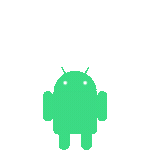

<h1 align="center"><u>Hi 👋, I am Don</u></h1>

  

- As featured on the [Kotlin Kenya newsletter](https://kotlinkenya.vercel.app/newsletter/episode-27) 
- Android Developer at Mentorlst 💼
- Working on Android apps with Jetpack Compose 💻

## Technical articles
- [How to build a progress bar in Jetpack Compose](https://medium.com/@donaldokara123/how-to-build-a-progress-bar-in-jetpack-compose-7482643833f0)
- [Compose Previews Done Right (After Doing Them Wrong)](https://medium.com/@donaldokara123/compose-previews-done-right-after-doing-them-wrong-ccd8ee990cf8)

  
  
  
  

